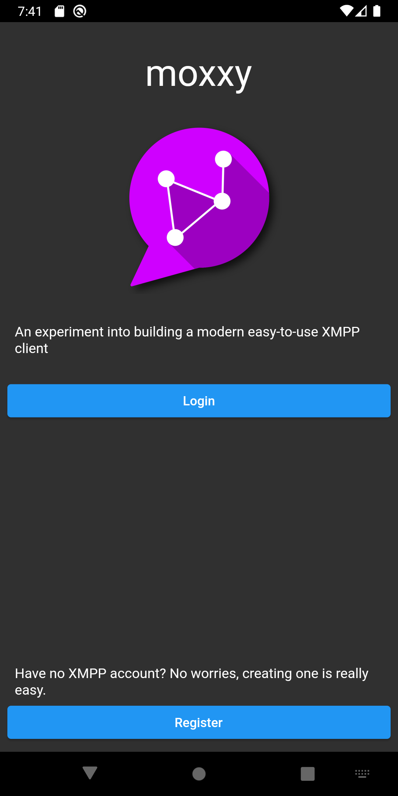
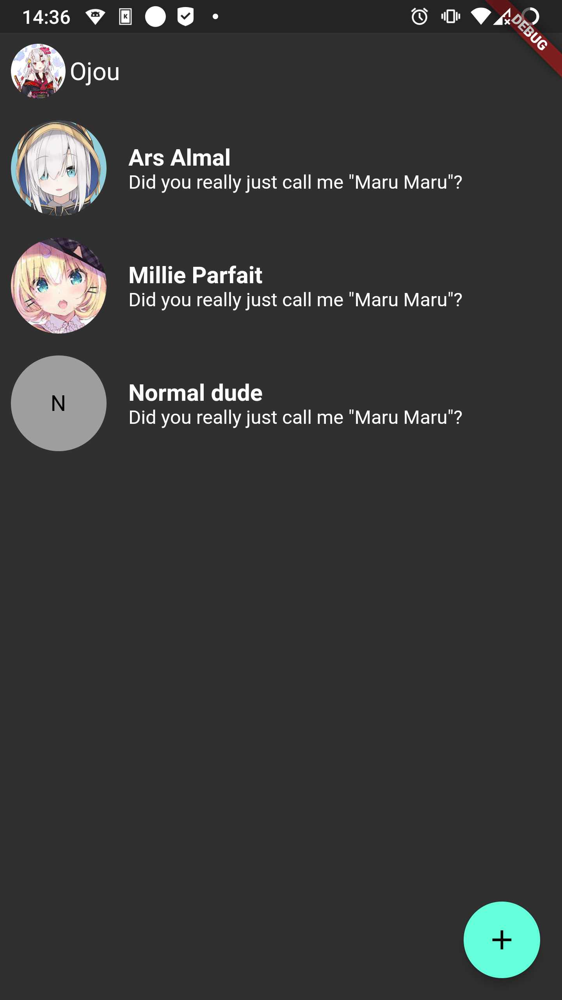
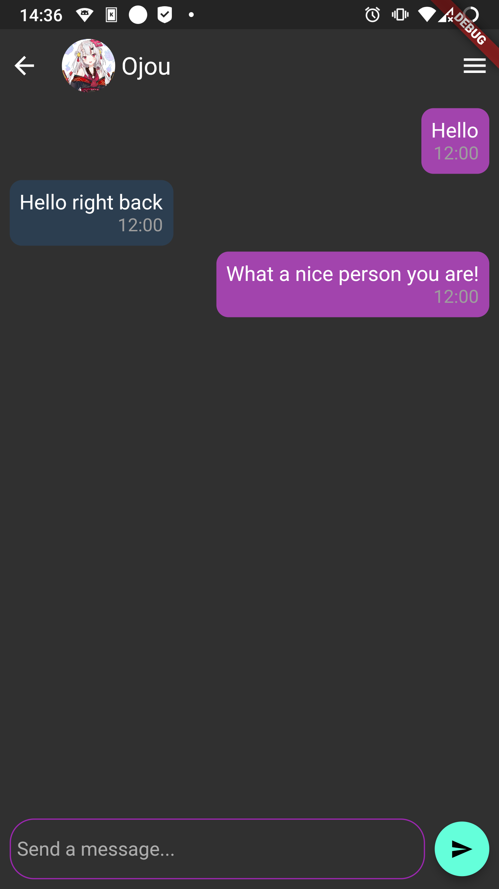

# moxxy

An experimental XMPP client that tries to be as easy, modern and beautiful as possible. This project
is the successor of moxxyv1, which was written in *React Native* and abandoned due to various technical
issues.

## Screenshots

## Developing and Building

Run `nix develop` to get a development shell. On first build, run `python tools/generate_licenses.py`
and `python tools/generate_providers.py` to generate the data classes. After that, you
can run the app using `flutter run` or build the app with `flutter build`.

## License

See `./LICENSE`.

## Special Thanks

- New logo designed by [Synoh](https://twitter.com/synoh_manda)
